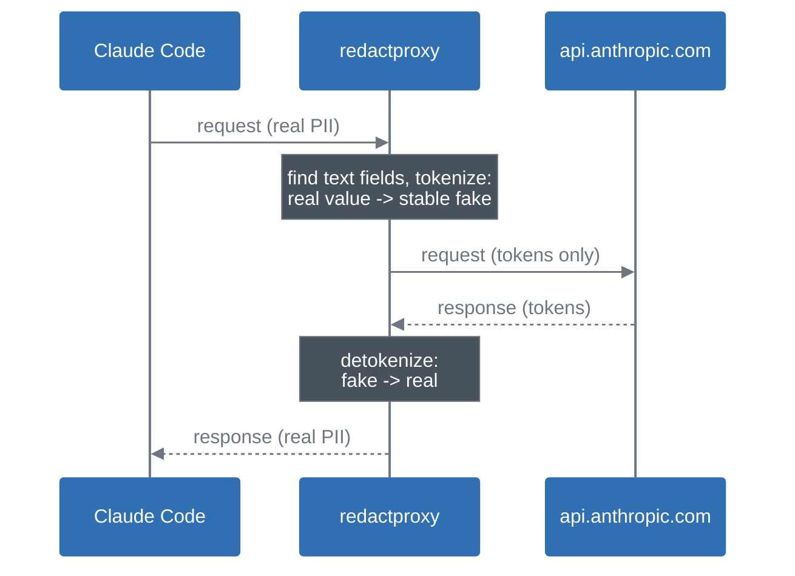

# RedactProxy

A local, two-way redaction proxy for [Claude Code](https://claude.com/claude-code),
or anything else that speaks the Anthropic Messages API. It sits
between the client and the real API: on the way out it replaces real
client data (domains, IPs, emails, credentials, and more) with stable
fake values, and on the way back it puts the real ones in again. Claude
only ever sees the fakes. Your tool calls still run against real
infrastructure.

Built for pentest and consulting teams who want to use Claude Code on a
live engagement without that client's data reaching the model provider.

## Why

When you run an AI coding agent on a live engagement, everything it
touches ends up in the model: client domains, internal hostnames,
credentials out of a config dump, employee emails, the client's own
name. Almost none of it has any reason to leave your machine. The model
doesn't need the real hostname to reason about a finding. It needs one
that stays the same every time it sees it.

That is all redactproxy does. It rewrites the API traffic and nothing
else: no added prompts, no tool restrictions, no change to how Claude
Code behaves. It listens on loopback and refuses to start on any other
address.

## How it works



A given real value always maps to the same fake one for the life of an
**engagement** (one client project), so Claude can still work out that
two hosts belong to the same organization without ever seeing which
organization. Each engagement keeps its own storage and shares nothing
with the others.

"Token" here means a redaction placeholder, not the unit an LLM's
context window is measured in.

> Before you point this at real client data: `--debug-level` anything
> above `off` writes real client values to `debug.log` in plaintext.
> Leave it off unless you are actively debugging, and never share that
> file. See [Debug logging](#debug-logging).

## Documentation

The full manual is in [`docs/`](docs/src/SUMMARY.md), published at
<https://cspf-founder.github.io/redactproxy/>. The guides cover install
and your first engagement, the `rules` and `tokens` commands, Claude
Code configuration, and the threat model with its known gaps. The
reference section documents the CLI, every detector category, the
placeholder shapes, and `rules.json`.

Start with
[Your first engagement](https://cspf-founder.github.io/redactproxy/quickstart.html).
Read [Known gaps](https://cspf-founder.github.io/redactproxy/security/gaps.html)
before you point this at real client data.

## Quick start

```bash
go install github.com/CSPF-Founder/redactproxy/cmd/redactproxy@latest
```

Or from a clone, if you plan to change anything:

```bash
git clone https://github.com/CSPF-Founder/redactproxy.git
cd redactproxy
make install        # builds into (go env GOPATH)/bin
```

Check your shell can find it:

```bash
redactproxy -h
```

If that comes back "command not found", `$GOPATH/bin` isn't on your
`PATH`. Run `make build` instead and use `./bin/redactproxy` everywhere
`redactproxy` appears below.

Now set up an engagement:

```bash
cd /path/to/your/engagement-folder
redactproxy wizard --engagement eng-2026-014
```

The wizard first collects the client names and domains you always want
redacted, then asks which API this engagement talks to, either real
Claude or another provider speaking the same Messages API (z.ai, for
example). It finishes by offering two things for this folder: a
`CLAUDE.md` note explaining the placeholder shapes, and a
`.claude/settings.local.json` that points Claude Code at the proxy and
closes a few client-side channels that bypass it entirely (see [What
this doesn't protect](#what-this-doesnt-protect)).

It also warns if the folder you run it in is named after the client.
That path is embedded in every request in a part the proxy never scans,
so no rule can redact it.

Then, in the same folder:

```bash
redactproxy      # terminal 1
claude           # terminal 2; the wizard already pointed it at the proxy
```

Or without the wizard:

```bash
redactproxy --engagement eng-2026-014 &
export ANTHROPIC_BASE_URL=http://127.0.0.1:8787
claude
```

`ANTHROPIC_BASE_URL` is what Claude Code reads to decide where to send
its traffic. It only applies to the shell you set it in, so close that
terminal when you're done with the engagement (or `unset` it) to avoid
an unrelated session later going through the same proxy by accident.

`redactproxy memory` prints a short note worth pasting into the
engagement's `CLAUDE.md`. It explains what the placeholder shapes mean,
so Claude treats them as values to reuse verbatim instead of typos to
correct.

Skipping the wizard is fine. You just lose those two conveniences, the
`CLAUDE.md` note and the settings hardening, and have to do them
yourself.

## Storage locations

Each engagement is a self-contained directory under a base data
directory, `$HOME/.redactproxy` by default or wherever `--data-dir`
points:

```
$HOME/.redactproxy/
└── engagements/
    └── eng-2026-014/
        ├── tokens.db      # real <-> fake mapping (bbolt), persists across runs
        ├── rules.json     # enabled categories, custom block/allow entries
        ├── upstream.txt   # this engagement's API provider, if not Anthropic
        └── debug.log      # opt-in only, contains REAL values when enabled
```

Passing `--engagement` also drops a `.redactproxy-engagement` marker in
the working directory, and later commands run from that folder pick the
name up from there, so you only have to type it once. Passing a
different name overwrites the marker.

None of this is sent anywhere. There is no telemetry, no sync, no
backup.

## Command reference

```
redactproxy [flags]             start the proxy
redactproxy wizard [flags]      interactive engagement setup, start here
redactproxy rules <subcommand>  show | validate | enable | disable | block | allow | remove
redactproxy tokens <subcommand> show | remove, against already-minted tokens
redactproxy memory [--write P]  print (or append) the CLAUDE.md placeholder note
redactproxy version             print the build this binary was made from
```

Every subcommand takes `-h`. A few things worth knowing up front.

`rules block "XYZCorp"` redacts that value wherever it appears,
matching case-insensitively as a substring, so it catches
"XYZCorporation" too. If the value is a domain, add `--domain`;
see [Blocking a domain](#blocking-a-domain).

`rules allow "mylab.internal"` is the opposite, and matches the exact
value only. That's deliberately narrower than `block`: an allow entry
takes protection away, so it should be as specific as possible.

`rules disable <category>` turns off a detector category
(`cloud.aws`, `network.mac`, and so on) for one engagement. `rules
show` lists all of them with descriptions. It also flags the
`allowlist.*` categories, where disabling one means *more* gets
redacted rather than less.

You can type the same things into a running proxy's terminal (`show`,
`remove <value>`, `rules ...`, `help`) if you'd rather not interrupt a
session to fix a mapping.

Rule changes only affect text tokenized from that point on. Adding a
`block` rule won't scrub a value that already reached the model earlier
in the same conversation, so start a fresh one if that matters.
Disabling a category likewise only gates future detection; anything
already tokenized keeps detokenizing correctly.

### Blocking a domain

By default `rules block` treats its value as opaque text: matched and
redacted, nothing about it preserved. Add `--domain` when the value
really is a domain and it gets the same structure-preserving treatment
as any domain the tool finds on its own, everywhere that domain turns
up, whether as a subdomain, inside an email address, or in a URL:

```bash
redactproxy rules block --domain "xyzcorp-fixture.internal"
```

The wizard's "Domains" prompt does this for you, so anything entered
there already counts as a domain entry.

Always give the base domain, no `www.` and no subdomain. Subdomains,
emails and URLs are resolved from the base automatically; it doesn't
work in the other direction. Entering a subdomain by mistake still
works, since it resolves back to the base, but the CLI will point it
out.

Internal-only names work too: an Active Directory forest, a private
naming scheme, anything that will never appear on a public TLD list.
`--domain` takes your word for it and only checks that the value is
syntactically a hostname. A URL, an email address or an arbitrary
string still gets added, but as an ordinary literal value, with a
warning explaining why.

The same thing by hand in `rules.json` is an `is_domain` field:

```json
{"value": "xyzcorp-fixture.internal", "regex": false, "is_domain": true}
```

A hand-edited file gets no interactive warning, so a nonsensical
`is_domain` (set on a URL by accident, say) is handled quietly instead
of breaking anything: it falls back to an ordinary literal block value,
and `redactproxy` logs a one-time warning at startup or reload.

## Debug logging

`--debug-level` controls diagnostic logging to `debug.log`, off by
default. Every level above `off` writes real client values to disk in
plaintext. Treat the file like the engagement data itself and delete it
when you're done.

| Level | Logs |
|---|---|
| `off` (default) | nothing |
| `new` | the real value the first time each one is seen |
| `replacements` | every substitution, every time |
| `full` | entire request/response bodies, real and tokenized |

Levels are cumulative. `full` in particular grows fast, because every
logged request body is the whole conversation history so far, so the
log is rotated and gzipped once it passes `--debug-log-max-mb` (10 MiB
by default).

## Multiple engagements, multiple providers

`--upstream` accepts any base URL that speaks the Anthropic Messages
API. It defaults to real Claude, and something like z.ai works with no
changes on this side. The wizard sets this up interactively, including
writing the provider's API key into the folder's
`.claude/settings.local.json`, and each engagement remembers its own
choice, so different client projects can run against different
providers side by side.

A provider with a genuinely different wire format, such as the
OpenAI-shaped tools Codex CLI uses, won't work. The detection and
streaming code is built around the Messages API shape specifically;
z.ai works because it deliberately exposes an Anthropic-compatible
endpoint, not because this is provider-agnostic.

To run several engagements at once, start one `redactproxy` per
engagement on its own `--listen` address and point each Claude Code
session at the matching port. One process serves exactly one
engagement.

## What this doesn't protect

Detection is regex-based and only ever sees request and response
bodies. Known gaps:

- Encoded data. A `.env` piped through `base64`, an `xxd` dump,
  Terraform state: all of it goes straight through. Decode it locally
  and look first.
- Names and prose. Only recognizable shapes get detected, so client
  names, codenames and similar need `rules block`.
- Bare apex domains on file-extension TLDs (`.do`, `.ai`, `.rs`, `.sh`,
  `.py` and friends), since `main.rs` and `logo.ai` are far more often
  filenames. Use `rules block --domain` for those.
- Your folder name. Claude Code puts the working directory in the
  `system` field, which is never scanned, so don't name an engagement
  folder after the client. redactproxy warns about it but can't fix it.
- `thinking` blocks, which are signed by the API and so can't be
  rewritten. If a real value leaks some other way, the model can
  restate it there permanently. Start a new conversation.
- HTTP headers, forwarded verbatim and never inspected.
- Claude Code's own transcripts, which keep the real values you saw on
  screen, same as terminal scrollback.
- Claude Code's other traffic. Feature flags and token refresh don't go
  through `ANTHROPIC_BASE_URL` at all. The wizard's settings hardening
  closes what config can close.

Found one that isn't on this list? Please open an
[issue](https://github.com/CSPF-Founder/redactproxy/issues), describing
the shape of the value rather than the value itself.
[SECURITY.md](SECURITY.md) covers what to report privately instead.

## Building and testing

```bash
make build   # bin/redactproxy for the current platform
make test    # go test ./...
make race    # go test -race -count=1 ./...
make vet     # go vet ./...
make lint    # golangci-lint (installed separately)
make check   # vet + race, run this before calling anything done
make fuzz    # exploratory fuzzing, 60s per target
make dist    # cross-compiled binaries (linux/darwin/windows, amd64/arm64)
```

Requires Go 1.26.6 or newer. See [CONTRIBUTING.md](CONTRIBUTING.md) to
work on the code and [SECURITY.md](SECURITY.md) for where to report
what.

## License

Copyright (C) 2026 Cyber Security & Privacy Foundation

Released under the [GNU General Public License v3.0 or later](LICENSE)
(`GPL-3.0-or-later`). This program comes with ABSOLUTELY NO WARRANTY;
see the license for details.
